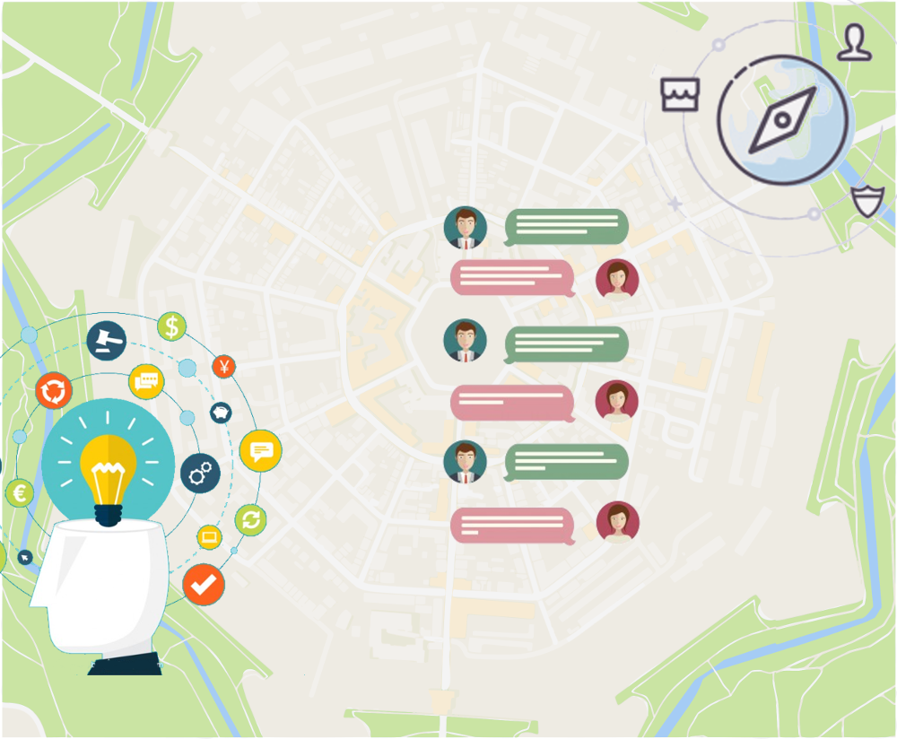

# pyt
ProjektYouTopia will be a space where people who have had an idea and want to develop it will be able to access to look for companions with whom to share their project and complete it. At the same time, people who want to be part of a project without having the idea can find various opportunities for cooperation. This space will be a digital platform, more precisely a city where potential innovators can get in touch with people they would never meet live, but they need to complete their project, as they have skills complementary to their own that they can not easily find within the network of their knowledge.

  

## Dashboard

...in progress...
